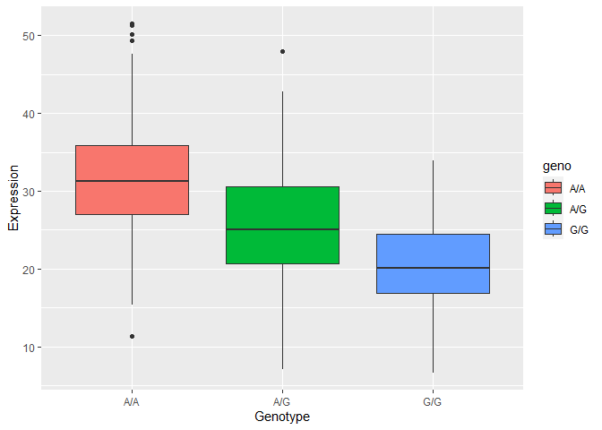

# lab 11: Genomic informatics
Elsa Chen (A16632961)

> Q13: Read this file into R and determine the sample size for each
> genotype and their corresponding median expression levels for each of
> these genotypes.

``` r
df <- read.table("rs8067378_ENSG00000172057.6.txt")
```

``` r
unique(df$geno)
```

    [1] "A/G" "A/A" "G/G"

``` r
sum(df$geno == "A/G")
```

    [1] 233

``` r
sum(df$geno == "A/A")
```

    [1] 108

``` r
sum(df$geno == "G/G")
```

    [1] 121

``` r
median(df[df$geno == "A/G",]$exp)
```

    [1] 25.06486

``` r
median(df[df$geno == "A/A",]$exp)
```

    [1] 31.24847

``` r
median(df[df$geno == "G/G",]$exp)
```

    [1] 20.07363

> Q14: Generate a boxplot with a box per genotype, what could you infer
> from the relative expression value between A/A and G/G displayed in
> this plot? Does the SNP effect the expression of ORMDL3?

``` r
library(ggplot2)
```

``` r
ggplot(df, aes(geno, exp, fill = geno)) +
  geom_boxplot() +
  labs(x = "Genotype", y = "Expression")
```



having G in one of the alleles is associated with low expression of
ORMDL3
