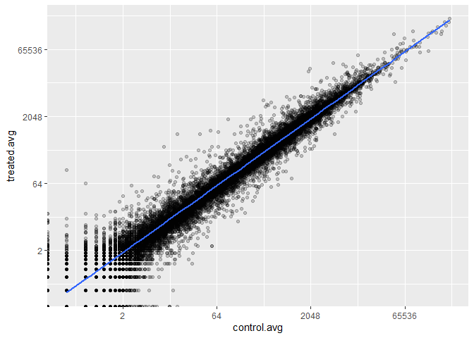

# lab 13: Transcriptomics and the analysis of RNA-Seq data
Elsa Chen (A16632961)

Analyzing a published RNA-seq experiment where airway smooth muscle
cells were treated with dexamethasone, a synthetic glucocortiroid
steroid with anti-inflammatory effects.

## Import data

``` r
counts <- read.csv("airway_scaledcounts.csv", row.names=1)
metadata <-  read.csv("airway_metadata.csv")
library(tidyverse)
```

    ── Attaching core tidyverse packages ──────────────────────── tidyverse 2.0.0 ──
    ✔ dplyr     1.1.3     ✔ readr     2.1.4
    ✔ forcats   1.0.0     ✔ stringr   1.5.0
    ✔ ggplot2   3.4.3     ✔ tibble    3.2.1
    ✔ lubridate 1.9.2     ✔ tidyr     1.3.0
    ✔ purrr     1.0.2     
    ── Conflicts ────────────────────────────────────────── tidyverse_conflicts() ──
    ✖ dplyr::filter() masks stats::filter()
    ✖ dplyr::lag()    masks stats::lag()
    ℹ Use the conflicted package (<http://conflicted.r-lib.org/>) to force all conflicts to become errors

## Examine data

> How many genes are in this dataset?

``` r
nrow(counts)
```

    [1] 38694

> How many control cell lines do we have?

``` r
table(metadata$dex)
```


    control treated 
          4       4 

``` r
all(colnames(counts) == metadata$id)
```

    [1] TRUE

## Analysis

Start by comparing control and treated columns. I will find the average
for each gene in all control columns and the average for all treated
columns

``` r
# finding control averages
control.ind <- metadata$dex == "control"
control.cts <- counts[,control.ind]
control.avg <- apply(control.cts, 1, mean)
```

``` r
# finding treated averages
treated.avg <- apply(counts[,metadata$dex == "treated"], 1, mean)
```

``` r
# combine the two
meancounts <- data.frame(control.avg, treated.avg)
```

plot the means against each other to see if drug has an effect on the
samples

``` r
ggplot(meancounts, aes(control.avg, treated.avg)) +
  geom_point(alpha = 0.2) +
  geom_smooth(method = lm) +
  scale_x_continuous(trans = "log2") +
  scale_y_continuous(trans = "log2")
```

    Warning: Transformation introduced infinite values in continuous x-axis

    Warning: Transformation introduced infinite values in continuous y-axis

    Warning: Transformation introduced infinite values in continuous x-axis

    Warning: Transformation introduced infinite values in continuous y-axis

    `geom_smooth()` using formula = 'y ~ x'

    Warning: Removed 16877 rows containing non-finite values (`stat_smooth()`).



log2 units are the most common because they have simple interpretations.

we will calculate the LFC of treated/control values and add it to our df

``` r
meancounts$log2fc <- log2(meancounts$treated.avg / meancounts$control.avg)
head(meancounts)
```

                    control.avg treated.avg      log2fc
    ENSG00000000003      900.75      658.00 -0.45303916
    ENSG00000000005        0.00        0.00         NaN
    ENSG00000000419      520.50      546.00  0.06900279
    ENSG00000000457      339.75      316.50 -0.10226805
    ENSG00000000460       97.25       78.75 -0.30441833
    ENSG00000000938        0.75        0.00        -Inf

there are some -Inf and NaN because of the 0 reads in the dataset. we
can filter the data to exclude these

``` r
to.keep <- rowSums(meancounts[,1:2] == 0) == 0
mycounts <- meancounts[to.keep,]
```

> How many genes do we have left after filtering?

``` r
nrow(mycounts)
```

    [1] 21817

a common threshold for up or down is \|LFC\| \> 2

> How many up regulated genes?

``` r
sum(mycounts$log2fc >= 2)
```

    [1] 314

> How many down regulated?

``` r
sum(mycounts$log2fc <= -2)
```

    [1] 485

## DESeq analysis

We are missing the statistics, we can get that properly with DESeq

``` r
library(DESeq2)
```

``` r
dds <- DESeqDataSetFromMatrix(countData = counts, 
                              colData = metadata, 
                              design = ~ dex)
```

    converting counts to integer mode

    Warning in DESeqDataSet(se, design = design, ignoreRank): some variables in
    design formula are characters, converting to factors

``` r
# run DESeq
dds <- DESeq(dds)
```

    estimating size factors

    estimating dispersions

    gene-wise dispersion estimates

    mean-dispersion relationship

    final dispersion estimates

    fitting model and testing

``` r
# get results
res <- results(dds)
head(res)
```

    log2 fold change (MLE): dex treated vs control 
    Wald test p-value: dex treated vs control 
    DataFrame with 6 rows and 6 columns
                      baseMean log2FoldChange     lfcSE      stat    pvalue
                     <numeric>      <numeric> <numeric> <numeric> <numeric>
    ENSG00000000003 747.194195     -0.3507030  0.168246 -2.084470 0.0371175
    ENSG00000000005   0.000000             NA        NA        NA        NA
    ENSG00000000419 520.134160      0.2061078  0.101059  2.039475 0.0414026
    ENSG00000000457 322.664844      0.0245269  0.145145  0.168982 0.8658106
    ENSG00000000460  87.682625     -0.1471420  0.257007 -0.572521 0.5669691
    ENSG00000000938   0.319167     -1.7322890  3.493601 -0.495846 0.6200029
                         padj
                    <numeric>
    ENSG00000000003  0.163035
    ENSG00000000005        NA
    ENSG00000000419  0.176032
    ENSG00000000457  0.961694
    ENSG00000000460  0.815849
    ENSG00000000938        NA

make a figure showing LFC vs padj

``` r
plot(res$log2FoldChange, -log(res$padj))
abline(v = -2, col = "grey")
abline(v = 2, col = "grey")
abline(h = -log(0.05), col = "grey")
```


``` r
# add some colors
mycols <- rep("gray", nrow(res))
mycols[ abs(res$log2FoldChange) > 2 ]  <- "red" 

inds <- (res$padj < 0.01) & (abs(res$log2FoldChange) > 2 )
mycols[ inds ] <- "blue"
```

``` r
# Volcano plot with custom colors 
plot( res$log2FoldChange,  -log(res$padj), 
 col=mycols, ylab="-Log(P-value)", xlab="Log2(FoldChange)" )

# Cut-off lines
abline(v=c(-2,2), col="gray", lty=2)
abline(h=-log(0.1), col="gray", lty=2)
```


## Adding annotation data

``` r
# BiocManager::install("AnnotationDbi")
# BiocManager::install("org.Hs.eg.db")
library("AnnotationDbi")
```


    Attaching package: 'AnnotationDbi'

    The following object is masked from 'package:dplyr':

        select

``` r
library("org.Hs.eg.db")
```

``` r
columns(org.Hs.eg.db)
```

     [1] "ACCNUM"       "ALIAS"        "ENSEMBL"      "ENSEMBLPROT"  "ENSEMBLTRANS"
     [6] "ENTREZID"     "ENZYME"       "EVIDENCE"     "EVIDENCEALL"  "GENENAME"    
    [11] "GENETYPE"     "GO"           "GOALL"        "IPI"          "MAP"         
    [16] "OMIM"         "ONTOLOGY"     "ONTOLOGYALL"  "PATH"         "PFAM"        
    [21] "PMID"         "PROSITE"      "REFSEQ"       "SYMBOL"       "UCSCKG"      
    [26] "UNIPROT"     

``` r
head(res)
```

    log2 fold change (MLE): dex treated vs control 
    Wald test p-value: dex treated vs control 
    DataFrame with 6 rows and 6 columns
                      baseMean log2FoldChange     lfcSE      stat    pvalue
                     <numeric>      <numeric> <numeric> <numeric> <numeric>
    ENSG00000000003 747.194195     -0.3507030  0.168246 -2.084470 0.0371175
    ENSG00000000005   0.000000             NA        NA        NA        NA
    ENSG00000000419 520.134160      0.2061078  0.101059  2.039475 0.0414026
    ENSG00000000457 322.664844      0.0245269  0.145145  0.168982 0.8658106
    ENSG00000000460  87.682625     -0.1471420  0.257007 -0.572521 0.5669691
    ENSG00000000938   0.319167     -1.7322890  3.493601 -0.495846 0.6200029
                         padj
                    <numeric>
    ENSG00000000003  0.163035
    ENSG00000000005        NA
    ENSG00000000419  0.176032
    ENSG00000000457  0.961694
    ENSG00000000460  0.815849
    ENSG00000000938        NA

Gene IDs are in the row names of res, and are from the ENSEMBL database
(based on a google search)

``` r
res$symbol <- mapIds(org.Hs.eg.db,
                     keys=row.names(res), # Our genenames
                     keytype="ENSEMBL", # The format of our genenames
                     column="SYMBOL", # The new format we want to add
                     multiVals="first")
```

    'select()' returned 1:many mapping between keys and columns

``` r
head(res)
```

    log2 fold change (MLE): dex treated vs control 
    Wald test p-value: dex treated vs control 
    DataFrame with 6 rows and 7 columns
                      baseMean log2FoldChange     lfcSE      stat    pvalue
                     <numeric>      <numeric> <numeric> <numeric> <numeric>
    ENSG00000000003 747.194195     -0.3507030  0.168246 -2.084470 0.0371175
    ENSG00000000005   0.000000             NA        NA        NA        NA
    ENSG00000000419 520.134160      0.2061078  0.101059  2.039475 0.0414026
    ENSG00000000457 322.664844      0.0245269  0.145145  0.168982 0.8658106
    ENSG00000000460  87.682625     -0.1471420  0.257007 -0.572521 0.5669691
    ENSG00000000938   0.319167     -1.7322890  3.493601 -0.495846 0.6200029
                         padj      symbol
                    <numeric> <character>
    ENSG00000000003  0.163035      TSPAN6
    ENSG00000000005        NA        TNMD
    ENSG00000000419  0.176032        DPM1
    ENSG00000000457  0.961694       SCYL3
    ENSG00000000460  0.815849       FIRRM
    ENSG00000000938        NA         FGR

We also want genename and entrezid

``` r
res$genename <- mapIds(org.Hs.eg.db,
                     keys=row.names(res), # Our genenames
                     keytype="ENSEMBL", # The format of our genenames
                     column="GENENAME", # The new format we want to add
                     multiVals="first")
```

    'select()' returned 1:many mapping between keys and columns

``` r
res$entrezid <- mapIds(org.Hs.eg.db,
                     keys=row.names(res), # Our genenames
                     keytype="ENSEMBL", # The format of our genenames
                     column="ENTREZID", # The new format we want to add
                     multiVals="first")
```

    'select()' returned 1:many mapping between keys and columns

``` r
head(res)
```

    log2 fold change (MLE): dex treated vs control 
    Wald test p-value: dex treated vs control 
    DataFrame with 6 rows and 9 columns
                      baseMean log2FoldChange     lfcSE      stat    pvalue
                     <numeric>      <numeric> <numeric> <numeric> <numeric>
    ENSG00000000003 747.194195     -0.3507030  0.168246 -2.084470 0.0371175
    ENSG00000000005   0.000000             NA        NA        NA        NA
    ENSG00000000419 520.134160      0.2061078  0.101059  2.039475 0.0414026
    ENSG00000000457 322.664844      0.0245269  0.145145  0.168982 0.8658106
    ENSG00000000460  87.682625     -0.1471420  0.257007 -0.572521 0.5669691
    ENSG00000000938   0.319167     -1.7322890  3.493601 -0.495846 0.6200029
                         padj      symbol               genename    entrezid
                    <numeric> <character>            <character> <character>
    ENSG00000000003  0.163035      TSPAN6          tetraspanin 6        7105
    ENSG00000000005        NA        TNMD            tenomodulin       64102
    ENSG00000000419  0.176032        DPM1 dolichyl-phosphate m..        8813
    ENSG00000000457  0.961694       SCYL3 SCY1 like pseudokina..       57147
    ENSG00000000460  0.815849       FIRRM FIGNL1 interacting r..       55732
    ENSG00000000938        NA         FGR FGR proto-oncogene, ..        2268

save results into csv

``` r
write.csv(res, "deseq_results.csv")
```

## Pathway analysis

``` r
BiocManager::install( c("pathview", "gage", "gageData") )
```

    Bioconductor version 3.17 (BiocManager 1.30.23), R 4.3.1 (2023-06-16 ucrt)

    Warning: package(s) not installed when version(s) same as or greater than current; use
      `force = TRUE` to re-install: 'pathview' 'gage' 'gageData'

    Installation paths not writeable, unable to update packages
      path: C:/Program Files/R/R-4.3.1/library
      packages:
        boot, cluster, codetools, foreign, KernSmooth, lattice, mgcv, nlme, rpart,
        spatial, survival

    Old packages: 'backports', 'BH', 'brio', 'broom', 'bslib', 'cachem', 'callr',
      'cli', 'cpp11', 'data.table', 'DBI', 'dbplyr', 'desc', 'digest', 'dplyr',
      'evaluate', 'fansi', 'farver', 'fastmap', 'fs', 'GenomeInfoDb',
      'GenomicRanges', 'ggplot2', 'glue', 'gtable', 'haven', 'highr', 'jsonlite',
      'knitr', 'lifecycle', 'locfit', 'lubridate', 'matrixStats', 'munsell',
      'openssl', 'pkgload', 'prettyunits', 'processx', 'progress', 'ps', 'ragg',
      'Rcpp', 'RcppArmadillo', 'RCurl', 'readr', 'reprex', 'rlang', 'rmarkdown',
      'rprojroot', 'RSQLite', 'rstudioapi', 'rvest', 'S4Vectors', 'sass', 'scales',
      'SparseM', 'stringi', 'stringr', 'systemfonts', 'testthat', 'textshaping',
      'tidyr', 'tidyselect', 'timechange', 'tinytex', 'utf8', 'uuid', 'vctrs',
      'vroom', 'waldo', 'withr', 'xfun', 'xml2', 'yaml'

``` r
library(pathview)
```

    ##############################################################################
    Pathview is an open source software package distributed under GNU General
    Public License version 3 (GPLv3). Details of GPLv3 is available at
    http://www.gnu.org/licenses/gpl-3.0.html. Particullary, users are required to
    formally cite the original Pathview paper (not just mention it) in publications
    or products. For details, do citation("pathview") within R.

    The pathview downloads and uses KEGG data. Non-academic uses may require a KEGG
    license agreement (details at http://www.kegg.jp/kegg/legal.html).
    ##############################################################################

``` r
library(gage)
```

``` r
library(gageData)

data(kegg.sets.hs)

# Examine the first 2 pathways in this kegg set for humans
head(kegg.sets.hs, 2)
```

    $`hsa00232 Caffeine metabolism`
    [1] "10"   "1544" "1548" "1549" "1553" "7498" "9"   

    $`hsa00983 Drug metabolism - other enzymes`
     [1] "10"     "1066"   "10720"  "10941"  "151531" "1548"   "1549"   "1551"  
     [9] "1553"   "1576"   "1577"   "1806"   "1807"   "1890"   "221223" "2990"  
    [17] "3251"   "3614"   "3615"   "3704"   "51733"  "54490"  "54575"  "54576" 
    [25] "54577"  "54578"  "54579"  "54600"  "54657"  "54658"  "54659"  "54963" 
    [33] "574537" "64816"  "7083"   "7084"   "7172"   "7363"   "7364"   "7365"  
    [41] "7366"   "7367"   "7371"   "7372"   "7378"   "7498"   "79799"  "83549" 
    [49] "8824"   "8833"   "9"      "978"   

to run gage we need to provide a vector of fold change values

``` r
foldchange <- res$log2FoldChange
# add ENTREZIDs as names to the vector
names(foldchange) <- res$entrezid
head(foldchange)
```

           7105       64102        8813       57147       55732        2268 
    -0.35070302          NA  0.20610777  0.02452695 -0.14714205 -1.73228897 

Now run **gage** with this input and the KEGG pathways

``` r
keggres = gage(foldchange, gsets=kegg.sets.hs)
attributes(keggres)
```

    $names
    [1] "greater" "less"    "stats"  

``` r
pathview(gene.data=foldchange, pathway.id="hsa05310")
```

    'select()' returned 1:1 mapping between keys and columns

    Info: Working in directory C:/elsa/UCSD/Spring_24/BIMM_143/bimm143/lab13

    Info: Writing image file hsa05310.pathview.png


