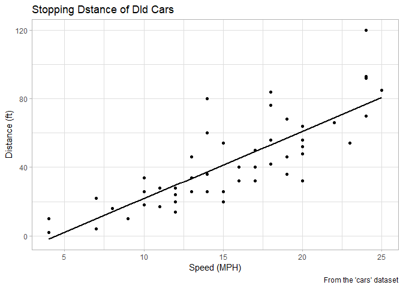
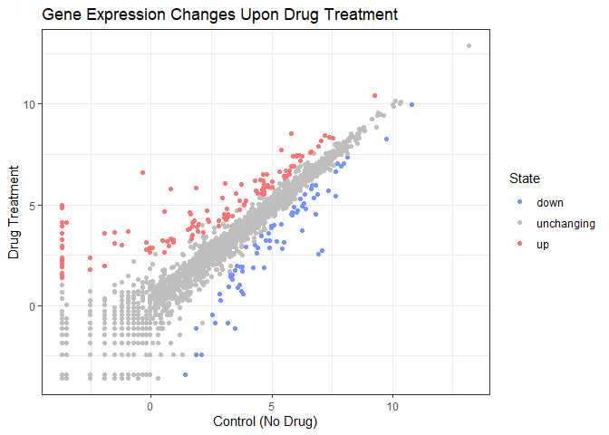
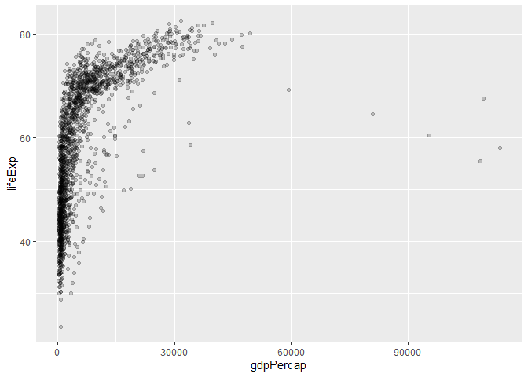
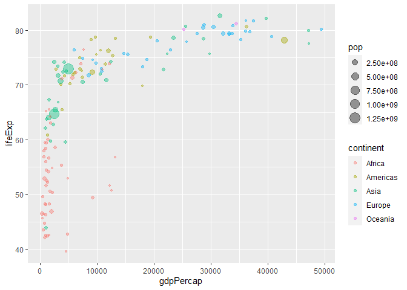
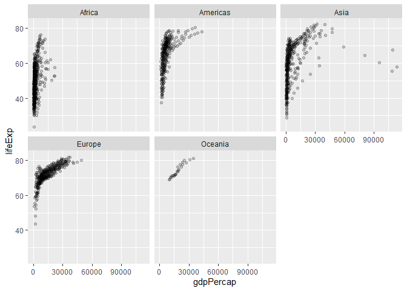

# Lab 5: ggplot2
Elsa Chen (A16632961)

- [basic usage](#basic-usage)
- [a more complicated scatter plot](#a-more-complicated-scatter-plot)
- [gapminder dataset - even more
  complicated](#gapminder-dataset---even-more-complicated)

First look at the **ggplot2** package to plot graphs. THere are also
other visualization systems including *“base”* plotting

``` r
plot(cars)
```


*base* plot is generally short code and fast but less visually appealing
**ggplot2** is more work but more robust and powerful

``` r
# ggplot(cars)
```

gives error because **ggplot2** needs to be installed and loaded. To
install: `install.packages("ggplot2")`

``` r
# to load:
library(ggplot2)
```

now ready to plot

### basic usage

``` r
ggplot(cars)
```


nothing plotted because need to specify:

- **data**: data.frame with the data to plot
- **aes**: which columns from df to plot (x, y, color, etc)
- **geom**: which type of plot

``` r
head(cars)
```

      speed dist
    1     4    2
    2     4   10
    3     7    4
    4     7   22
    5     8   16
    6     9   10

``` r
ggplot(cars) +
  aes(x = speed, y = dist) +
  geom_point()
```


to make the figure nicer

``` r
ggplot(cars) +
  aes(x = speed, y = dist) +
  geom_point() +
  geom_smooth(color = "black", se = FALSE, method = lm) +
  labs(x = "Speed (MPH)", y = "Distance (ft)", title = "Stopping Dstance of Dld Cars", caption = "From the 'cars' dataset") +
  theme_light()
```

    `geom_smooth()` using formula = 'y ~ x'



### a more complicated scatter plot

a plot of expression data

``` r
url <- "https://bioboot.github.io/bimm143_S20/class-material/up_down_expression.txt"
genes <- read.delim(url)
head(genes)
```

            Gene Condition1 Condition2      State
    1      A4GNT -3.6808610 -3.4401355 unchanging
    2       AAAS  4.5479580  4.3864126 unchanging
    3      AASDH  3.7190695  3.4787276 unchanging
    4       AATF  5.0784720  5.0151916 unchanging
    5       AATK  0.4711421  0.5598642 unchanging
    6 AB015752.4 -3.6808610 -3.5921390 unchanging

> answering the lab sheet

``` r
nrow(genes)
```

    [1] 5196

``` r
colnames(genes)
```

    [1] "Gene"       "Condition1" "Condition2" "State"     

``` r
ncol(genes)
```

    [1] 4

``` r
table(genes$State) 
```


          down unchanging         up 
            72       4997        127 

``` r
# OR
sum(genes$State == "up")
```

    [1] 127

``` r
round((sum(genes$State == "up") / nrow(genes)) * 100, 2)
```

    [1] 2.44

plotting

``` r
ggplot(genes) +
  aes(x = Condition1, y = Condition2, color = State) +
  geom_point() +
  scale_color_manual(values = c("#7391FF", "grey", "#FF7373")) +
  labs(title = "Gene Expression Changes Upon Drug Treatment", x = "Control (No Drug)", y = "Drug Treatment") +
  theme_bw()
```



### gapminder dataset - even more complicated

``` r
url <- "https://raw.githubusercontent.com/jennybc/gapminder/master/inst/extdata/gapminder.tsv"

gapminder <- read.delim(url)
```

``` r
dim(gapminder)
```

    [1] 1704    6

``` r
head(gapminder)
```

          country continent year lifeExp      pop gdpPercap
    1 Afghanistan      Asia 1952  28.801  8425333  779.4453
    2 Afghanistan      Asia 1957  30.332  9240934  820.8530
    3 Afghanistan      Asia 1962  31.997 10267083  853.1007
    4 Afghanistan      Asia 1967  34.020 11537966  836.1971
    5 Afghanistan      Asia 1972  36.088 13079460  739.9811
    6 Afghanistan      Asia 1977  38.438 14880372  786.1134

``` r
ggplot(gapminder) +
  aes(x = gdpPercap, y = lifeExp) +
  geom_point(alpha = 0.2)
```



> How many continents and countries?

``` r
length(unique(gapminder$continent))
```

    [1] 5

``` r
length(unique(gapminder$country))
```

    [1] 142

``` r
# install.package("dplyr")
library(dplyr)
```


    Attaching package: 'dplyr'

    The following objects are masked from 'package:stats':

        filter, lag

    The following objects are masked from 'package:base':

        intersect, setdiff, setequal, union

``` r
gapminder_2007 <- filter(gapminder, year == "2007")
```

``` r
ggplot(gapminder_2007)+
  aes(x = gdpPercap, y = lifeExp, color = continent, size = pop) +
  geom_point(alpha = 0.4)
```



facet

``` r
ggplot(gapminder) +
  aes(x = gdpPercap, y = lifeExp) +
  geom_point(alpha = 0.2) +
  facet_wrap(~continent)
```


