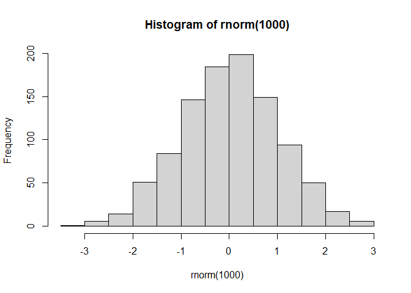
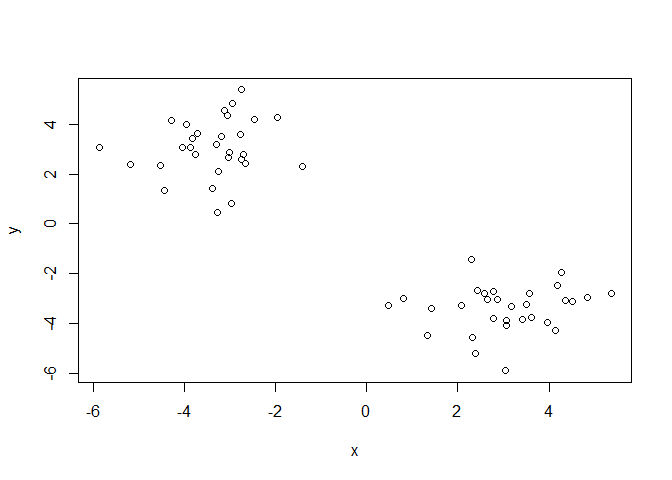
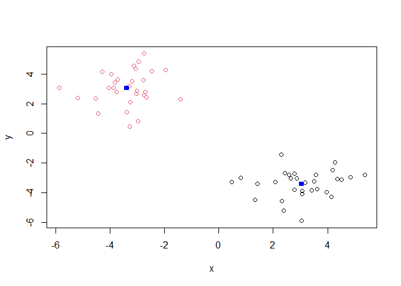
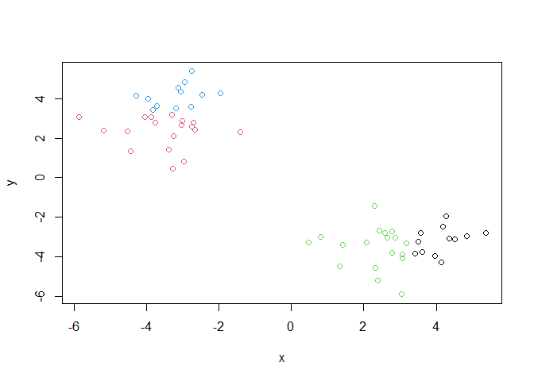
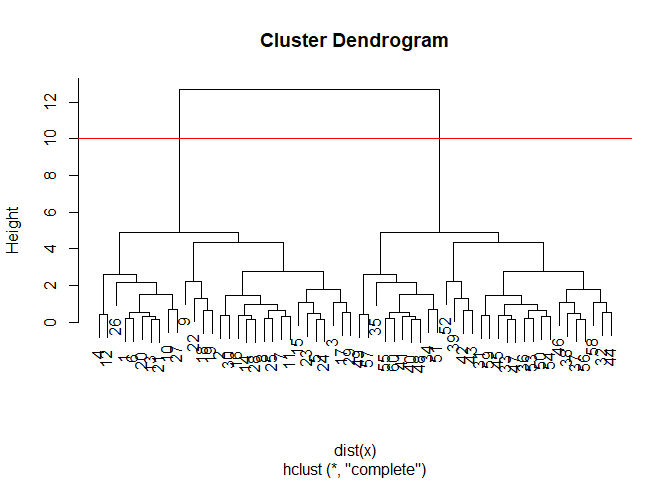
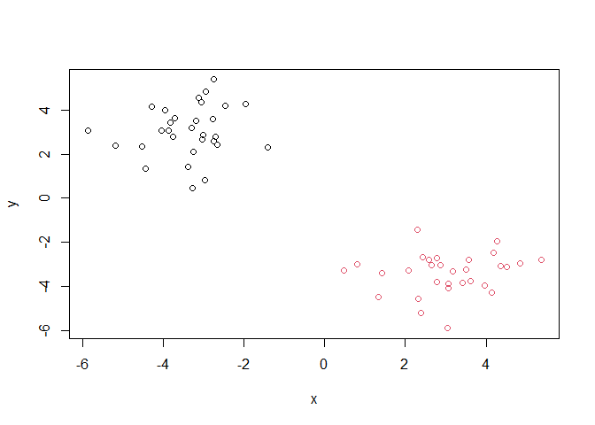
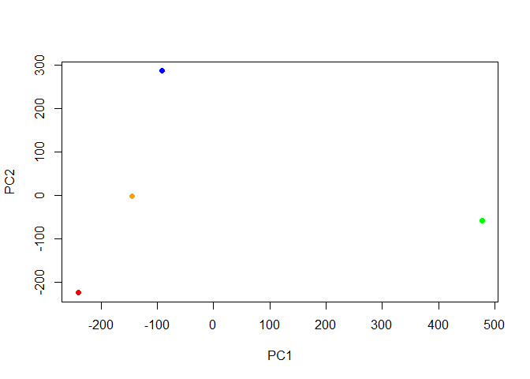
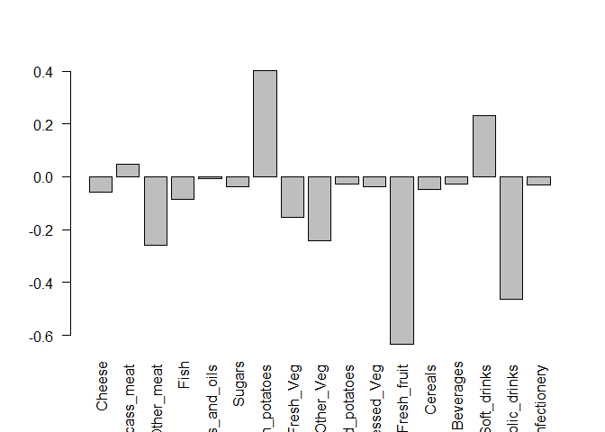

# lab7: machine learning I
Elsa Chen (A16632961)

- [Clustering](#clustering)
  - [Starting with “k-means” clustering
    (`kmeans()`)](#starting-with-k-means-clustering-kmeans)
  - [Hierarchical Clustering](#hierarchical-clustering)
- [Principal Component Analysis](#principal-component-analysis)
  - [PCA of RNAseq data](#pca-of-rnaseq-data)

Today we’re exploring first part of machine learing, clustering -
finding patterns in data and dimensionality reduction

## Clustering

### Starting with “k-means” clustering (`kmeans()`)

``` r
# making up data
hist(rnorm(1000))
```



``` r
temp <- c(rnorm(30, -3), rnorm(30, 3))
x <- cbind(x = temp, y = rev(temp))
plot(x)
```



now running `kmeans()`

``` r
km <- kmeans(x, centers = 2)
km
```

    K-means clustering with 2 clusters of sizes 30, 30

    Cluster means:
              x         y
    1  3.042713 -3.391078
    2 -3.391078  3.042713

    Clustering vector:
     [1] 2 2 2 2 2 2 2 2 2 2 2 2 2 2 2 2 2 2 2 2 2 2 2 2 2 2 2 2 2 2 1 1 1 1 1 1 1 1
    [39] 1 1 1 1 1 1 1 1 1 1 1 1 1 1 1 1 1 1 1 1 1 1

    Within cluster sum of squares by cluster:
    [1] 62.80272 62.80272
     (between_SS / total_SS =  90.8 %)

    Available components:

    [1] "cluster"      "centers"      "totss"        "withinss"     "tot.withinss"
    [6] "betweenss"    "size"         "iter"         "ifault"      

``` r
attributes(km)
```

    $names
    [1] "cluster"      "centers"      "totss"        "withinss"     "tot.withinss"
    [6] "betweenss"    "size"         "iter"         "ifault"      

    $class
    [1] "kmeans"

> Q. How many points in each cluster?

``` r
km$size
```

    [1] 30 30

> Q. What component of your result object details cluster
> assignment/membership?

``` r
km$cluster
```

     [1] 2 2 2 2 2 2 2 2 2 2 2 2 2 2 2 2 2 2 2 2 2 2 2 2 2 2 2 2 2 2 1 1 1 1 1 1 1 1
    [39] 1 1 1 1 1 1 1 1 1 1 1 1 1 1 1 1 1 1 1 1 1 1

> Q. What are centers/mean values of each cluster?

``` r
km$centers
```

              x         y
    1  3.042713 -3.391078
    2 -3.391078  3.042713

> Q. Make a plot of your data showing your clustering results
> (groupings/clusters and cluster centers)

``` r
plot(x, col = km$cluster)
points(km$centers, col = "blue", pch = 15)
```



> Q. Run `kmeans()` again and cluster in 4 groups and plot results

``` r
km2 <- kmeans(x, centers = 4)
plot(x, col = km2$cluster)
```



### Hierarchical Clustering

reveal structure in data by grouping points into a smaller number of
clusters `hclust()` this function does not take our imput data directly
but wants a “distance matrix” that details how (dis)similar all our
input points are to each other.

``` r
hc <- hclust(dist(x)) # dist() measures distance pairwise between each point
plot(hc)
abline(h = 10, col = "red")
```



to get my main result, main cluster

``` r
grps <- cutree(hc, h = 10)
```

``` r
plot(x, col = grps)
```



## Principal Component Analysis

``` r
url <- "https://tinyurl.com/UK-foods"
x <- read.csv(url)
```

> Q1. How many rows and columns are in your new data frame named x? What
> R functions could you use to answer this questions?

``` r
dim(x)
```

    [1] 17  5

``` r
head(x)
```

                   X England Wales Scotland N.Ireland
    1         Cheese     105   103      103        66
    2  Carcass_meat      245   227      242       267
    3    Other_meat      685   803      750       586
    4           Fish     147   160      122        93
    5 Fats_and_oils      193   235      184       209
    6         Sugars     156   175      147       139

> Q2. Which approach to solving the ‘row-names problem’ mentioned above
> do you prefer and why? Is one approach more robust than another under
> certain circumstances?

``` r
x <- read.csv(url, row.names = 1)
```

``` r
barplot(as.matrix(x), beside=T, col=rainbow(nrow(x)))
```


> Q3: Changing what optional argument in the above barplot() function
> results in the following plot?

``` r
barplot(as.matrix(x), beside=F, col=rainbow(nrow(x)))
```


> Q5: Generating all pairwise plots may help somewhat. Can you make
> sense of the following code and resulting figure? What does it mean if
> a given point lies on the diagonal for a given plot?

``` r
pairs(x, col=rainbow(10), pch=16)
```


if the points lie on the diagonal, there is an association between the
country on the x and y axes

hard to understand even for small data set, so let’s use PCA `prcomp()`

``` r
pca <- prcomp(t(x))
summary(pca)
```

    Importance of components:
                                PC1      PC2      PC3       PC4
    Standard deviation     324.1502 212.7478 73.87622 3.176e-14
    Proportion of Variance   0.6744   0.2905  0.03503 0.000e+00
    Cumulative Proportion    0.6744   0.9650  1.00000 1.000e+00

``` r
pca$x
```

                     PC1         PC2        PC3           PC4
    England   -144.99315   -2.532999 105.768945 -4.894696e-14
    Wales     -240.52915 -224.646925 -56.475555  5.700024e-13
    Scotland   -91.86934  286.081786 -44.415495 -7.460785e-13
    N.Ireland  477.39164  -58.901862  -4.877895  2.321303e-13

``` r
colors <- c("orange", "red", "blue", "green")
plot(pca$x[,1], pca$x[,2], col = colors, pch = 16, 
     xlab = "PC1", ylab = "PC2")
```



the “rotation” component tells us how much the original variables
contribute to the new PCs

``` r
barplot( pca$rotation[,1], las=2 )
```



PCA is useful for gaining insight into high dimensional data that is
difficult to examine in other ways

### PCA of RNAseq data

``` r
url2 <- "https://tinyurl.com/expression-CSV"
rna.data <- read.csv(url2, row.names=1)
head(rna.data)
```

           wt1 wt2  wt3  wt4 wt5 ko1 ko2 ko3 ko4 ko5
    gene1  439 458  408  429 420  90  88  86  90  93
    gene2  219 200  204  210 187 427 423 434 433 426
    gene3 1006 989 1030 1017 973 252 237 238 226 210
    gene4  783 792  829  856 760 849 856 835 885 894
    gene5  181 249  204  244 225 277 305 272 270 279
    gene6  460 502  491  491 493 612 594 577 618 638

``` r
## Again we have to take the transpose of our data 
pca <- prcomp(t(rna.data), scale=TRUE) # scales all data
summary(pca)
```

    Importance of components:
                              PC1    PC2     PC3     PC4     PC5     PC6     PC7
    Standard deviation     9.6237 1.5198 1.05787 1.05203 0.88062 0.82545 0.80111
    Proportion of Variance 0.9262 0.0231 0.01119 0.01107 0.00775 0.00681 0.00642
    Cumulative Proportion  0.9262 0.9493 0.96045 0.97152 0.97928 0.98609 0.99251
                               PC8     PC9      PC10
    Standard deviation     0.62065 0.60342 3.457e-15
    Proportion of Variance 0.00385 0.00364 0.000e+00
    Cumulative Proportion  0.99636 1.00000 1.000e+00

> Q: how many genes in this dataset?

``` r
nrow(rna.data)
```

    [1] 100

``` r
## Simple un polished plot of pc1 and pc2
plot(pca$x[,1], pca$x[,2], xlab="PC1", ylab="PC2")
```


``` r
# prettier ggplot
library(tidyverse)
```

    ── Attaching core tidyverse packages ──────────────────────── tidyverse 2.0.0 ──
    ✔ dplyr     1.1.3     ✔ readr     2.1.4
    ✔ forcats   1.0.0     ✔ stringr   1.5.0
    ✔ ggplot2   3.4.3     ✔ tibble    3.2.1
    ✔ lubridate 1.9.2     ✔ tidyr     1.3.0
    ✔ purrr     1.0.2     
    ── Conflicts ────────────────────────────────────────── tidyverse_conflicts() ──
    ✖ dplyr::filter() masks stats::filter()
    ✖ dplyr::lag()    masks stats::lag()
    ℹ Use the conflicted package (<http://conflicted.r-lib.org/>) to force all conflicts to become errors

``` r
res <- as.data.frame(pca$x)
head(res)
```

              PC1        PC2        PC3        PC4        PC5        PC6
    wt1 -9.697374  1.5233313 -0.2753567  0.7322391 -0.6749398  1.1823860
    wt2 -9.138950  0.3748504  1.0867958 -1.9461655  0.7571209 -0.4369228
    wt3 -9.054263 -0.9855163  0.4152966  1.4166028  0.5835918  0.6937236
    wt4 -8.731483 -0.7468371  0.5875748  0.2268129 -1.5404775 -1.2723618
    wt5 -9.006312 -0.2945307 -1.8498101 -0.4303812  0.8666124 -0.2496025
    ko1  8.846999  2.2345475 -0.1462750 -1.1544333 -0.6947862  0.7128021
                PC7         PC8         PC9         PC10
    wt1 -0.24446614  1.03519396  0.07010231 3.073930e-15
    wt2 -0.03275370  0.26622249  0.72780448 1.963707e-15
    wt3 -0.03578383 -1.05851494  0.52979799 2.893519e-15
    wt4 -0.52795595 -0.20995085 -0.50325679 2.872702e-15
    wt5  0.83227047 -0.05891489 -0.81258430 1.693090e-15
    ko1 -0.07864392 -0.94652648 -0.24613776 4.052314e-15

``` r
ggplot(res) +
  aes(x = PC1, y = PC2) +
  geom_point()  # PC1 spread is more important because in summary(pca), PC1 accounts for 92% of the variance
```


``` r
kmeans(pca$x[,1], centers = 2)
```

    K-means clustering with 2 clusters of sizes 5, 5

    Cluster means:
           [,1]
    1  9.125676
    2 -9.125676

    Clustering vector:
    wt1 wt2 wt3 wt4 wt5 ko1 ko2 ko3 ko4 ko5 
      2   2   2   2   2   1   1   1   1   1 

    Within cluster sum of squares by cluster:
    [1] 0.2648467 0.5017505
     (between_SS / total_SS =  99.9 %)

    Available components:

    [1] "cluster"      "centers"      "totss"        "withinss"     "tot.withinss"
    [6] "betweenss"    "size"         "iter"         "ifault"      
